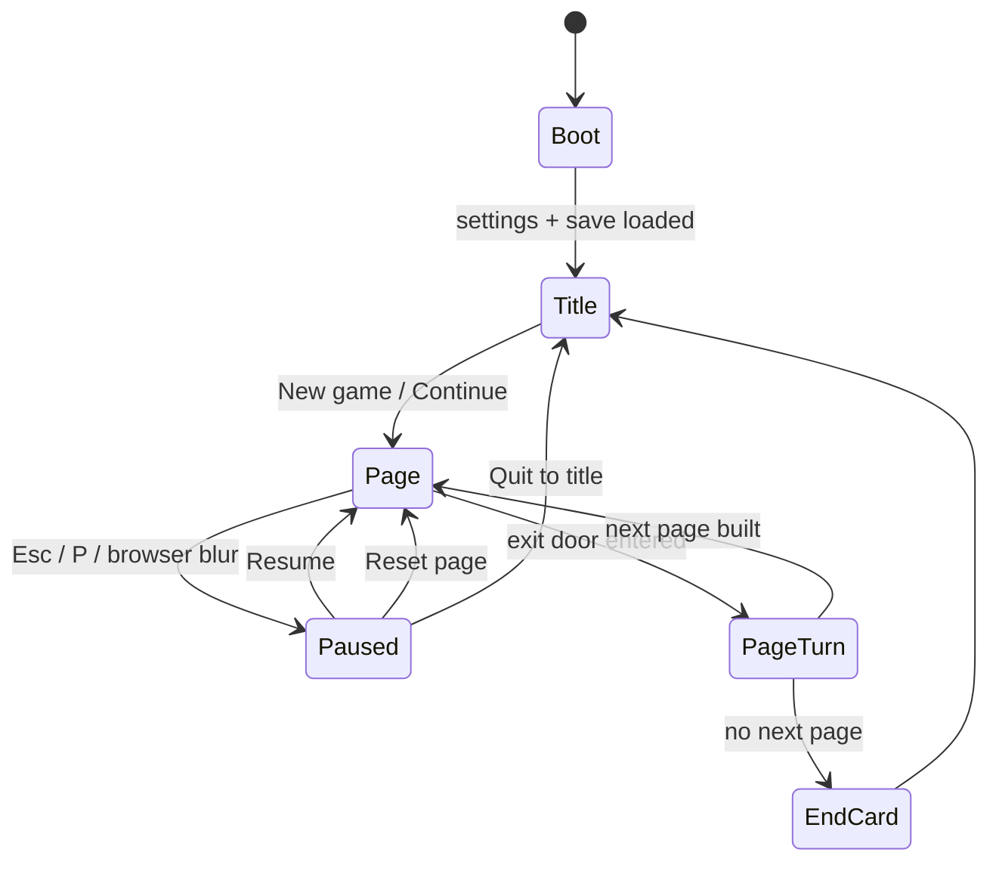
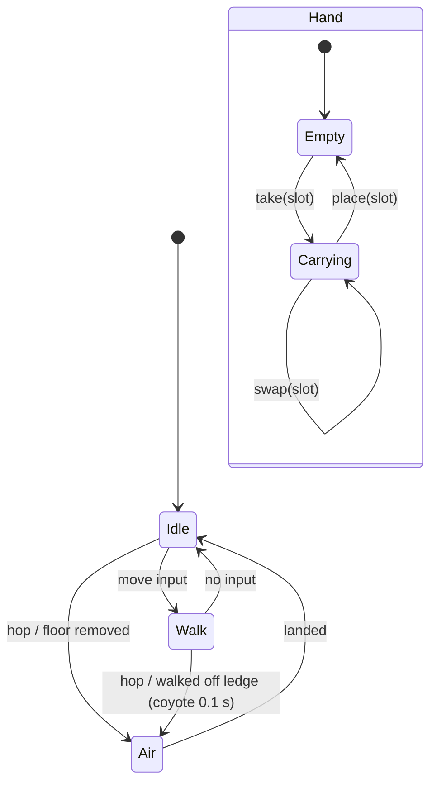
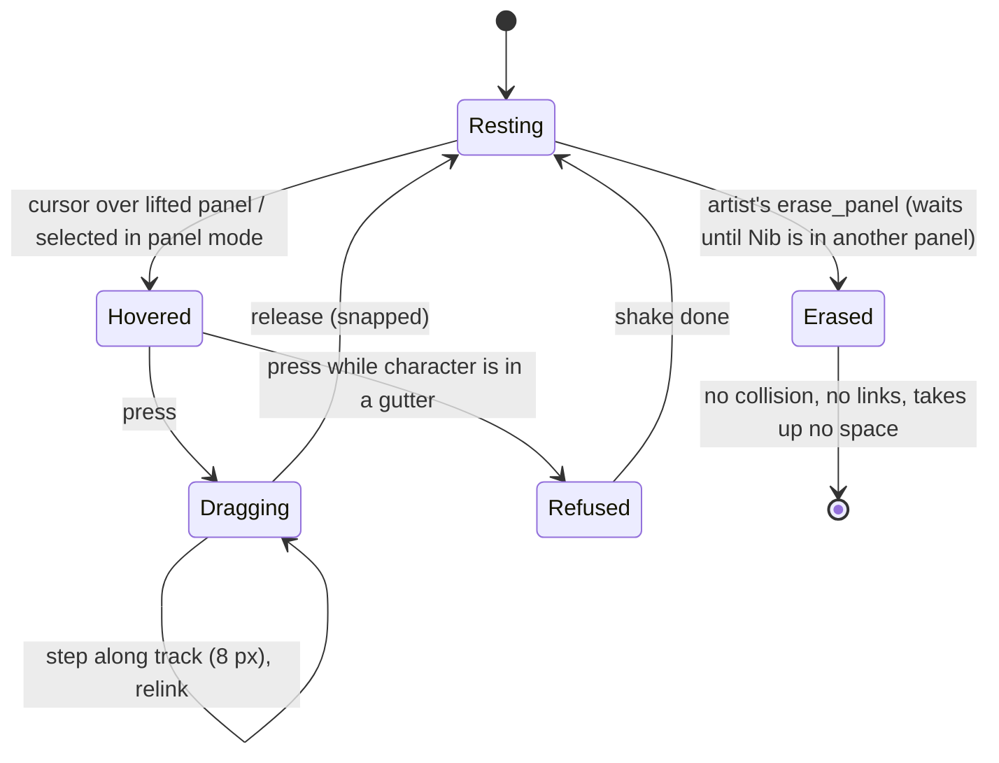
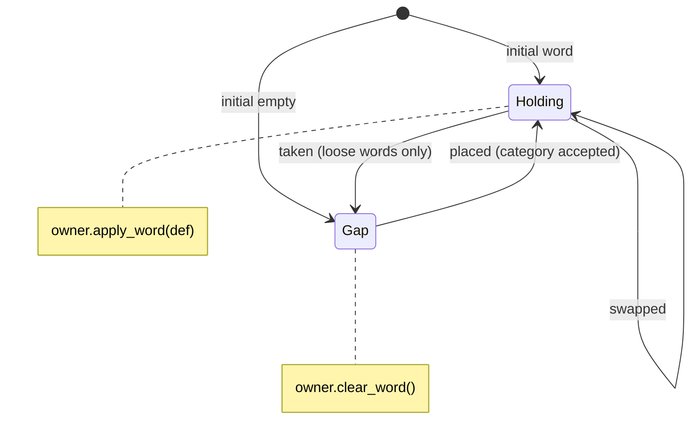

# Core Gameplay State Diagrams

## Game flow

```mermaid
stateDiagram-v2
  [*] --> Boot
  Boot --> Title: settings + save loaded
  Title --> Page: New game / Continue
  Page --> Paused: Esc / P / browser blur
  Paused --> Page: Resume
  Paused --> Page: Reset page
  Paused --> Title: Quit to title
  Page --> PageTurn: exit door entered
  PageTurn --> Page: next page built
  PageTurn --> EndCard: no next page
  EndCard --> Title
```

## Character (inside the drawing)

```mermaid
stateDiagram-v2
  [*] --> Idle
  Idle --> Walk: move input
  Walk --> Idle: no input
  Idle --> Air: hop / floor removed
  Walk --> Air: hop / walked off ledge (coyote 0.1 s)
  Air --> Idle: landed
  state Hand {
    [*] --> Empty
    Empty --> Carrying: take(slot)
    Carrying --> Carrying: swap(slot)
    Carrying --> Empty: place(slot)
  }
```

## Panel (outside the drawing)

```mermaid
stateDiagram-v2
  [*] --> Resting
  Resting --> Hovered: cursor over lifted panel / selected in panel mode
  Hovered --> Dragging: press
  Dragging --> Dragging: step along track (8 px), relink
  Dragging --> Resting: release (snapped)
  Hovered --> Refused: press while character is in a gutter
  Refused --> Resting: shake done
  Resting --> Erased: artist's erase_panel (waits until Nib is in another panel)
  Erased --> [*]: no collision, no links, takes up no space
```

## Word slot

```mermaid
stateDiagram-v2
  [*] --> Holding: initial word
  [*] --> Gap: initial empty
  Holding --> Gap: taken (loose words only)
  Gap --> Holding: placed (category accepted)
  Holding --> Holding: swapped
  note right of Holding: owner.apply_word(def)
  note right of Gap: owner.clear_word()
```
